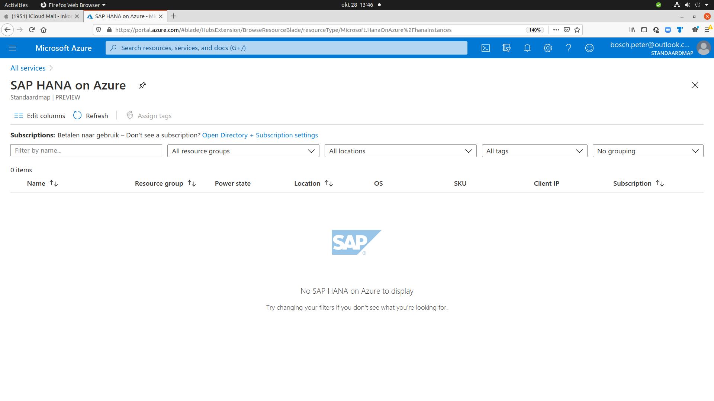
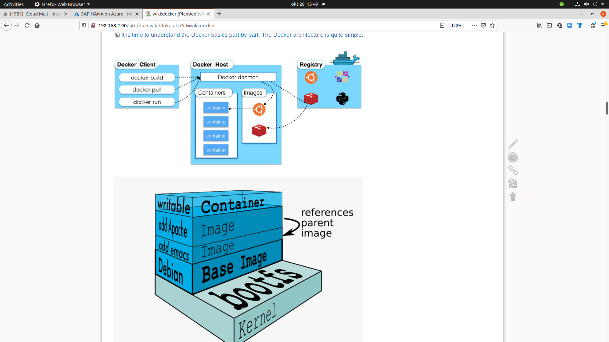
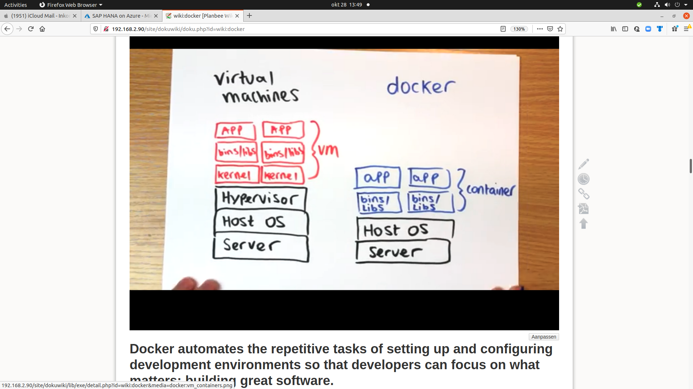
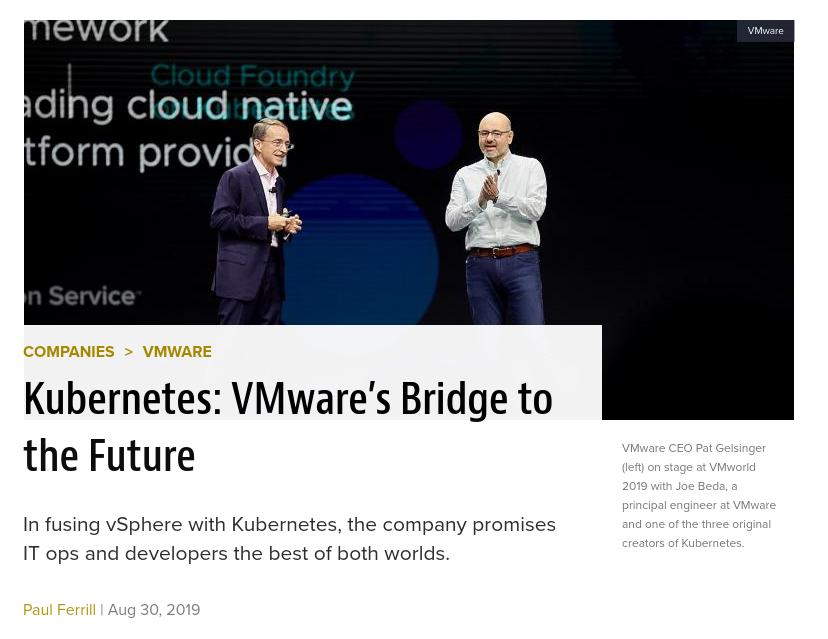
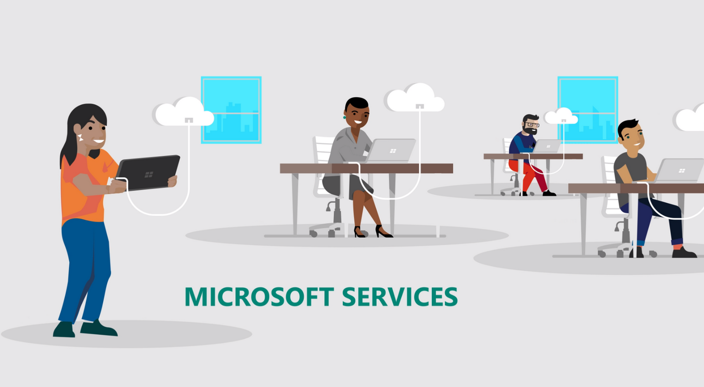
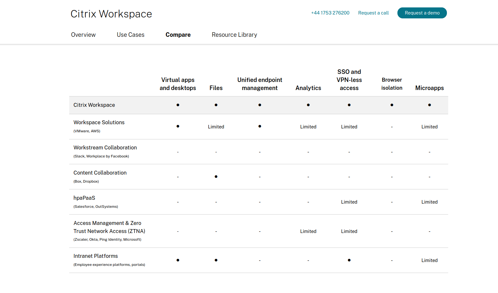
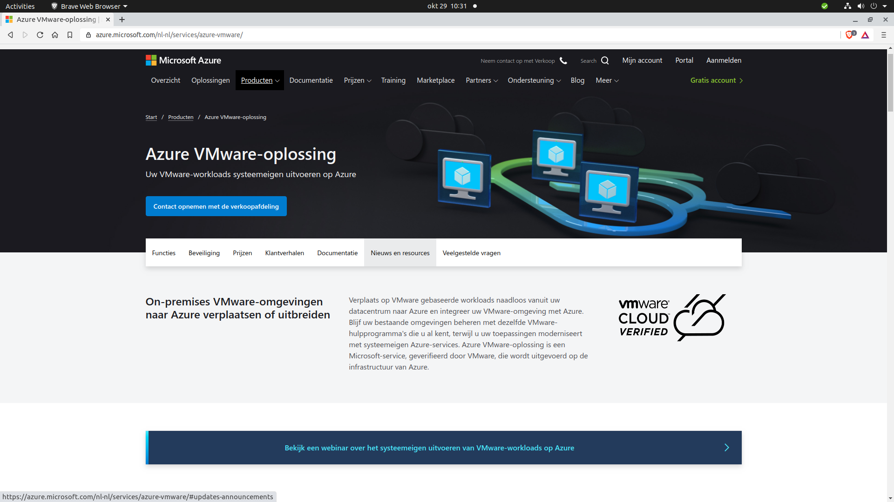
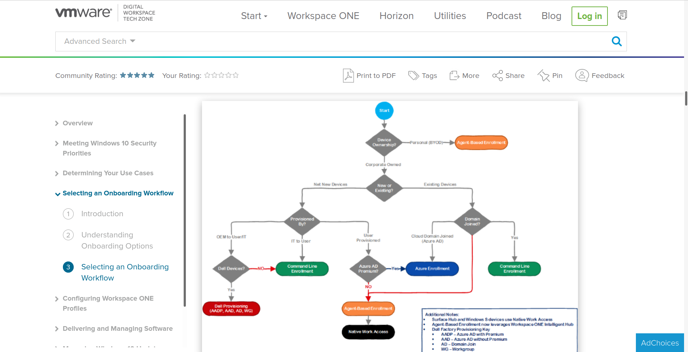
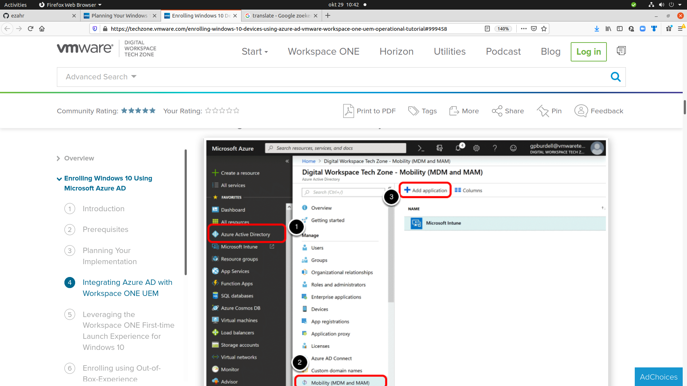
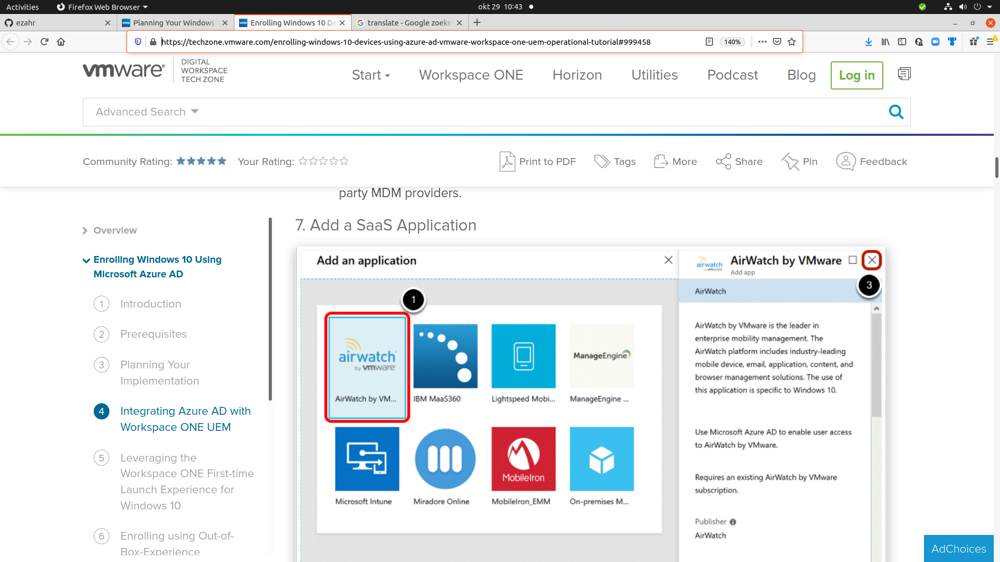

# VWware-Workspace-one airwatch tech

[https://www.vmware.com/products/workspace-one.html](Workspace ONE is a new VMware offering designed to directly address challenges faced by organizations in the consumerization of IT.)  Workspace ONE is the simple and secure enterprise platform that delivers and manages any app on any device by integrating identity, application, and enterprise mobility management.

[Workspace ONE is een nieuw VMware-aanbod](https://docs.vmware.com/en/VMware-Workspace-ONE-UEM/services/Windows_Desktop_Device_Management/GUID-AWT-ENROLL-OVERVIEWWD.html) dat is ontworpen om de uitdagingen waarmee organisaties worden geconfronteerd bij de consumentisering van IT rechtstreeks aan te pakken. Workspace ONE is het eenvoudige en veilige bedrijfsplatform dat elke app op elk apparaat levert en beheert door identiteits-, applicatie- en bedrijfsmobiliteitsbeheer te integreren.

Terwijl VMWare Cloud een traditioneel IaaS-model biedt. Terwijl Azure een veel breder scala aan opties biedt. Azure heeft ook een groot aantal diensten te bieden, binnen een redelijke prijsklasse. De VM Ware-computeromgeving wordt uitgevoerd in AWS-datacenters en Microsoft gebruikt zijn eigen infrastructuur

VMware Workstation Pro en Player draaien op de meeste 64-bits Windows- of Linux-hostbesturingssystemen: Windows 10; Windows Server 2019; Windows Server 2016 ...

Wat Workspace ONE levert

| Werknemerservaringen betrekken, van onboarding tot offboarding |
| ----------------------------------------------------------------- |
| Stelt ondernemingen in staat om de betrokkenheid en productiviteit van werknemers te maximaliseren door werknemers een persoonlijke ervaring en Day One-toegang tot elke app op elk apparaat te bieden.

| Uniform eindpuntbeheer |
| ----------------------------------------------------------------- |
| Consolideer managementsilo's op mobiele apparaten, desktops (inclusief Windows 10 en macOS), robuuste apparaten en "dingen". Verlaag de kosten en verbeter de beveiliging met real-time, draadloos modern beheer voor alle gebruiksscenario's (inclusief BYO).

| Intelligentie in de hele digitale werkruimte |
| ----------------------------------------------------------------- |
| Verzamel en correleer gegevens in uw gehele digitale werkruimte om inzichten, analyses en krachtige automatisering van veelvoorkomende IT-taken te stimuleren die de gebruikerservaring verbeteren, de beveiliging versterken en de IT-kosten verlagen. |

| Virtuele desktops en apps |
| ----------------------------------------------------------------- |
Transformeer traditionele VDI en gepubliceerde apps radicaal met geïntegreerde VMware Horizon en VMware Horizon Cloud, die ongekende eenvoud, flexibiliteit, snelheid en schaal bieden - en dat alles tegen lagere kosten. Een gemeenschappelijk besturingsvlak voor de "multi-cloud" maakt een architectuur en kostenmodel mogelijk om aan uw eisen te voldoen

| Veilige en eenvoudige toegang tot applicaties |
| ----------------------------------------------------------------- |
| Verhoog de productiviteit en verras werknemers met veilige, wachtwoordvrije eenmalige aanmelding (SSO) voor SaaS-, mobiele, Windows-, virtuele en webapps op elke telefoon, tablet of laptop - allemaal via één app-catalogus. |

| Vereenvoudig Zero Trust Security |
| ----------------------------------------------------------------- |
| Combineer intrinsieke beveiliging voor apparaten, gebruikers en apps om het inschakelen van Zero Trust-toegangscontrole te vereenvoudigen. Toonaangevend modern beheer van alle apparaten en toegangsbeheer voor alle applicaties maken toegangsmodellen zonder vertrouwen werkelijkheid. |

## Looking for an Alternative to AirWatch? 

[hexnode](https://www.hexnode.com/mobile-device-management/alternative-to-airwatch/?utm_source=Google&utm_medium=PPC&utm_campaign=Airwatchalternative&utm_term=Airwatchalternative&utm_content=Airwatchalternative&utm_keyword=436588861333&utm_device=&utm_adposition=&utm_matchtype=&utm_network=&utm_medium=googleads&utm_campaign=872470709&utm_source=43662563493&utm_term=%2Bairwatch&hsa_acc=6098326672&hsa_cam=9514878649&hsa_grp=107089103654&hsa_ad=461951423216&hsa_src=g&hsa_tgt=kwd-23731036682&hsa_kw=%2Bairwatch&hsa_mt=b&hsa_net=adwords&hsa_ver=3&gclid=Cj0KCQiAjKqABhDLARIsABbJrGkVCAZh393AdJ_w15281p9ODjKG2DB4bCuAJqgnR45NPfePw39K0M4aAsGgEALw_wcB#/secure-container)

## Microsoft Azure Active Directory Enrollment

tt

[windows-10-deployment-vmware-workspace-one-](https://techzone.vmware.com/planning-your-windows-10-deployment-vmware-workspace-one-operational-tutorial)

Workspace ONE UEM kan worden geïntegreerd met Azure AD en biedt een robuuste selectie van onboarding-workflows die van toepassing zijn op een breed scala aan Windows 10-gebruiksscenario's. Azure-licentievereisten bepalen echter dat u een extra Azure AD Premium-licentie moet aanschaffen om deze integratie te voltooien.
Bedrijven die gebruikmaken van Azure AD, gebruiken doorgaans een van de volgende onboarding-opties voor apparaten die eigendom zijn van het bedrijf:

    Enrolling using Out-of-Box-Experience
    Enrolling using Azure AD Join
    Enrolling with AutoPilot
    Enrolling using On-Premises Active Directory Domain

For personal-owned (BYOD) devices:
    Enrolling using Azure Connect

Azure AD ondersteunt vele configuraties, waaronder beheerde (wachtwoord-hash-synchronisatie of Pass-through-verificatie) of federatief (met behulp van een identiteitsprovider die zowel WS-Trust als WS-Fed-protocollen ondersteunt). Om deze opties te vereenvoudigen, zullen we ons concentreren op hoe u uw gebruikers toevoegt aan Azure AD. Als u uw gebruikers rechtstreeks in Azure AD aanmaakt, noemen we dit pure Azure AD. Als u gebruikers maakt in lokale AD of een andere gebruikersbron van derden, noemen we dit hybride Azure AD. Omdat gebruikers in het hybride model worden gesynchroniseerd met Azure AD, krijgen gebruikers een onveranderlijk ID-kenmerk. Dit onveranderlijke ID-kenmerk is vereist in latere stappen

SurfaceHubs die hen helpen beheren via OMA-DM via AirWatch. De SurfaceHub CSP is een serviceprovider die specifiek is voor Microsoft Surface Hub-hardware en niet van toepassing is op andere apparaattypen

Je hebt verschillende onboarding-opties bij het gebruik van opdrachtregelregistratie. Van onboarding met een PC Lifecycle Management-oplossing (PCLM) zoals SCCM met Workspace ONE AirLift tot het implementeren van een script via een groepsbeleidsobject (GPO), alle opties hebben één ding gemeen. Al deze opties maken gebruik van de opdrachtregelparameters die worden ondersteund door Workspace ONE Intelligent Hub.

nav 

>>Volgens mij is het plan de virtuele W10 omgeving vanuit BDO op VMWare te draaien als standaard virtualisatie platform, zoals dat nu voor 8.1 ook het geval is.

>>Verder draait er momenteel SCCM voor management onprem omgeving , maar vanuit een moderne werkplek bekeken met uitbreiding naar cloud en management van

>>mobiele devices zal ook gekeken moeten worden naar Intune... Ik hoop dat dit snel concreet op de agenda komt.

Waar de VM Ware-computeromgeving wordt uitgevoerd weet ik niet (eigen infrastructuur?)  VMWare Cloud biedt een traditioneel IaaS-model. Terwijl Azure een veel breder scala aan opties biedt.  . 

Interessant beeld wat ik vandaag heb gezien.   https://techzone.vmware.com/planning-your-windows-10-deployment-vmware-workspace-one-operational-tutorial

Screenshot from 2020-10-29 10-36-46.png

SurfaceHubs die hen helpen beheren via OMA-DM via AirWatch. De SurfaceHub CSP is een serviceprovider die specifiek is voor Microsoft Surface Hub-hardware en niet van toepassing is op andere apparaattypen

Als u gebruikers maakt in lokale AD of een andere gebruikersbron van derden, noemen we dit hybride Azure AD.
Omdat gebruikers in het hybride model worden gesynchroniseerd met Azure AD,
krijgen gebruikers een onveranderlijk ID-kenmerk. Dit onveranderlijke ID-kenmerk is vereist in latere stappen

Nog niets niets ik alleen dat  opties  gebruik (kunnen) maken van de  AAD Hub.
Structureren is beperken is betekenis geven in een hybride model lijkt me dat in de tijd gezien minder eenduidig. (achteraf zit je dan met duplicatie businesskeys?)
Als de gebruikers rechtstreeks aangemaakt worden in Azure AD , noemen we dit pure Azure AD.   Voor mij de single source of truth. 
Precies wat jij schrijft  :  Ik hoop dat  [pure Azure AD] snel concreet op de agenda komt.   1 stickerlijst voor  zowel provisioning-by OEM2userIT-staff en User  

Weer een stukje ontdekt  (vanuit de context van Azure Active Directory)   

hoi Christiaan,

Weet je wat het allerleukste is onze mail wisseling   Ineens zie ik dingen die al sudderden in mijn achterhoofd. VMware is best raar bezig met hun implementatie

VMware-inzicht
Waarom zou je in vredesnaam nog Kind (Kubernetes-in-Docker) gebruiken van VMWare (betaald) Als je dit standaard met Docker-desktop (gratis) meegeleverd krijgt en je daarmee een stabielere versie hebt?
Dat ze het doen snap ik wel, maar waarom je het zou moeten willen niet. VMware pakt volgens mij best wel wat overhead op de container nodes als ik het zo bekijk door de Node als Fysieke container te draaien.
Hierdoor krijg je dus Containers die in containers draaien, met alle overhead van dien. Dus  VMware is best raar bezig met hun implementatie, maar ik heb dan liever een single-node cluster,
waar minder overhead op zit.  Zeker op  mijn 16GB machine is het anders niet te doen.   En ja 32 GB is tegenwoordig minimum , weet ik. .  Met hardware power wordt doorgaans heel wat gemaskeerd.
Over de ondersteuning van Fusion voor de komende op ARM gebaseerde Macs meldt VMware ook nog niets. met dit inzicht (weet niet of het waar is)  hoop ik dat dit snel concreet op de agenda komt.
Stel dat het windows-team dit ook in het snotje heeft (stel dat deze observatie waar is)

Dat geeft de burger weer moed.  jeuh  Was het niet zo dat InTune aanvankelijk voor MobileDevices bedoeld was maar met komst van W10 geintegreerd met ConfigMgr.
waardoor  Microsoft Endpoint Manager nu een zelfstandige service is, geïntegreerd eindpuntbeheerplatform voor het beheren van alle eindpunten.

In dit Microsoft Endpoint Manager-beheercentrum is ConfigMgr aka MSSC en Microsoft Intune geïntegreerd.of zie ik dat verkeerd.?  dan hebben we het qua tooling toch over het zelfde, het heette vroeger anders
maar hier synergie uit te behalen valt.  (buiten mijn scope maar toch)
Definitie:
Microsoft Endpoint Configuration Manager (Configuration Manager, ook bekend als ConfigMgr of SCCM),   een softwareproduct voor systeembeheer ontwikkeld door Microsoft voor het beheer
van grote groepen van computers met Windows NT, Windows Embedded, macOS (OS X), Linux of UNIX,  evenals mobiele besturingssystemen voor Windows Phone, Symbian, iOS en Android.
dan klopt het grote Cloud  plaatje en dan moet de persistentie ergens bewaard gaan worden.  Kan me voorstellen dat dat in Ams of parijs moet zijn.  Die gaat nog boven mijn pet.

Active directory (AD) is als een database die wordt gebruikt om gebruikers, groepen en computers van de organisatie op te slaan.
Azure Active Directory is de cloudversie van en  bestaat (alleen? dat is het issue?) in de datacenters van Microsoft die informatie over gebruikers, groepen enz. opslaat
Microsoft investeert USD 1 jaarlijks meer dan een miljard in onderzoek en ontwikkeling van cybersecurity.  
Screenshot from 2020-10-28 16-47-26.png

Intune maar ook MobileIron kan worden geïntegreerd met Azure AD (Active Directory) om te bepalen wie toegang heeft en waartoe ze toegang hebben.
Het maakt gebruik van Azure AD-identiteit om organisatiegegevens te isoleren van persoonlijke gegevens.

We kunnen aannemen dat de pandemie van 2020 zowel de acceptatie als de implementatie van Azure AD een vliegende start gaf om te voldoen aan de eisen van een extern personeelsbestand.
Gebruikers en groepen zijn de basisbouwstenen voor Azure AD.  Stel je voor dat BD gebruikers kan indelen in groepen die zich allemaal op dezelfde manier zullen gedragen
En zure AD kan identiteiten bevatten voor gebruikers binnen uw organisatie en gebruikers van buiten uw organisatie die een Microsoft-account hebben.

Screenshot from 2020-10-28 16-51-19.png

Ik ga morgen maurice of richard bellen.

Fijne avond. Mooie inzichten weer vandaag uit het kleine beetje kennis dat ik bezit.  Wat wijsheid is mogen architecten bepalen.

Hoi Peter,

 

Volgens mij is het plan de virtuele W10 omgeving vanuit BDO op VMWare te draaien als standaard virtualisatie platform, zoals dat nu voor 8.1 ook het geval is.

Verder draait er momenteel SCCM voor management onprem omgeving , maar vanuit een moderne werkplek bekeken met uitbreiding naar cloud en management van mobiele devices zal ook gekeken moeten worden naar Intune... Ik hoop dat dit snel concreet op de agenda komt.

 

Mvg,
Chris

 

From: Peter Bosch <bosch.peter@icloud.com>
Sent: Wednesday, October 28, 2020 12:51 PM
To: Christiaan van Munster <Christiaan.van.Munster@microsoft.com>
Subject: [EXTERN] Re: [EXTERN] 'voortgang'.. Intune bij MCC (icm AAD?)

 

 

Excuse voor de typo's in mijn mail.  Omdat HA en allerlei tooling die ik bij Logius Private Cloud thuis meteen NOOB draaien van GitLab  Harbor Containers Kubernetes hou ik de moed erin.  Nextcloud en mattermost zijn mijn twee laatste

aanwinsten.   Elke avond een uurtje HA en gebruik github/lab voor opslag yaml.code

 

 

Ik heb inmiddels honderden Azure screenshots verzameld.  Alles gedocumenteerd in github  en on-premise-gitlab.  ( Snap trouwens ook niet zo goed waarom er geen rijks-github is. btw )  Niet iedereen is van opensource hoewel

het al vaak veel beter is dan de commerciele producten. 

 

 

 Kan me ook niet zo goed voorstellen dat ze beheer van Win10 DBO met vmware willen doen.  Intune past niet alleen bij MCC van origine maar nu ook bij Win10.    

 

 

Wordt vervolgd.  (verwerking is bezig;-)     

 

 

 

fijne dag. 

 

Op 28 oktober 2020 om 3:11 uur schreef Christiaan van Munster <Christiaan.van.Munster@microsoft.com>:

Hoi Peter,

 

Dank voor de uitgebreide update! Heel fijn dat je bevestiging vindt in het verhaal van Ronald, en ook hetzelfde advies over de bühne probeert te krijgen bij jouw collega’s.

 

De stap naar AAD is niet zozeer een grote stap, maar veelal wel een éérste eerste stap naar de cloud (en zoals je ziet ook een vereise om meer mooie dingen te gaan doen zoals Intune, O365, Azure, etc). Daar zien we vaak “angst” om deze eerste stap te nemen, en commitment om de voordelen van huidge cloud oplosingen te omarmen. Deze (mijn collega noemt het terecht “cloudwatervrees”)

Wij zijn met diverse partijen bij de belastingdienst in gesprek om  deze kar verder in beweging te krijgen, waarbij implementeren van AAD wat mij betreft bij de basis hoort waar we asap mee aan de slag moeten.

 

Voor wat betreft het openen van de support ticket voor intune: ik zie dat je het partnerkanaal een ticket probeert te openen. Dat is niet correct – zie  https://docs.microsoft.com/en-us/mem/get-support. Wil jij die weg eens proberen?  (Aangezien jij jouw eigen test omgeving en niet productieomgeving van Belastingdienst gebruikt zal jouw tenant niet aan Premier gekoppeld zijn, maar zou je alsnog wel een support ticket aan moeten kunnen melden). Laat svp even weten of dat lukt?

 

Thx,
Chris

 

Ps-leuk te zien dat je een HA fan bent geworden! Ik zit hier voorlopig nog vast aan domoticz vrees ik – ha staat op mijn agenda, maar ontbreekt mij helaas aan tijd om daar komende mee te gaan bouwen ☹

 

From: Peter Bosch <bosch.peter@icloud.com>
Sent: Wednesday, October 28, 2020 10:48 AM
To: Christiaan van Munster <Christiaan.van.Munster@microsoft.com>
Subject: [EXTERN] 'voortgang'.. Intune bij MCC (icm AAD?)

 

Hoi Chris,

 

"litereatuur-studie'  heb ik naar eer en geweten nu voor mijn gevoel afgesloten. Bedankt voor de linkjes !

Veel  mogen lezen en door mijn bril gezien  is de combi  Intune+AAD optimaal.  Dus zie eigenlijk voor bevestigingen van wat Ronald Kamphuis mij influisterde 

https://community.connection.com/azure-active-directory-microsoft-intune-match-made-mobile-first-heaven/

 

Margo Pulles (de andere architect bij MCC)  zei in de laatste team-meeting ook het idee om door de vragen bij het Windows-team van Richard Rook en Maurice Rosmuller.  Leendert sprak dat meteen tegen.   

Ik heb ook wel gezien dat AAD een flinke stap richting cloud is (en of een Belastingdienst dat wel wil ,  maar volgens mij toont de c-crisis aan dat we snel naar een modernere werkplek situatie moeten gaan.)
Dat is ook de uitdaging voor Windows10migratie  DigitaleBrugOverheids Diensten.   Spannende tijden dus.  Data is a liabilty  Security is a share responsibility.!   daar is een soort van centralisatie voor nodig. 

 

Onderstaande beeld raakt mij enorm. Want dat is preces wat je doet bij het modelleren van gegevens.  

 

Zodra je een soort van model gaat leggen over de entiteiten (cloud-enabled-security) moeten eerst de entiteiten worden neergelegd zodat ze zonder kruisende lijnen optreden (analyse verlamming down-the-road)
Moet daarbij terug denken aan de tijd dat de eerst  webservers kwamen. Wilde men toen ook niet meteen aan.  Beetje rare gedachte kronkel maar is imho volledig in lijn met wat Ronald aangeeft. 

(structureren=beperken=betekenis geven) losse entiteiten en daar een model overheen. pas dan komt security tot zijn recht,  maar daar komt ook AAD om de hoek kijken.  It is all about identities.   

Praktijk leeft mij ook dat men geneigd is om dat niet als eerste te doen.  (er te veel bijhalen voor die ene entiteit die je wil inrichten)

... Anyways In ieder geval naar eer en geweten. de boodschap van Ronald Kamphuis overgebracht.  Ik hoop niet dat ze de messenger afschieten want heb nog steeds geen werkende omgeving

en  kan alleen maar gokken op een werkend resultaat )  (itt ha zie ps)

Concreet heb ik het MDM -issue waar ik meteen de eerste dag al tegen aanliep.  

Ik weet hoe de blade eruit gaat zien. 

Vraag = Kun jij me helpen aan een kanaal om dit via een ticket te gaan tackelen.   Ik heb mijn prive-account bosch.peter@outlook.com   met zowel Intune en AAD enabled.   

https://docs.microsoft.com/en-us/troubleshoot/mem/intune/set-mdm-authority
Via Maurice Rosmuller probeer ik ook via een belastingdienst kanaal te tackelen.  Opmerkelijk is dat ik geen mail-feedback krijg.   Wellicht dat ik iets groters aantik, en wat vele architecten bezighoud Ook die bij ICTU)   

Dus deze mail is een support vraag. lukt me niet om via een BOT de vraag te stellen. 

Probleem is imho logisch MDM pas dan kan ik zelf devices gaan registeren.   Doorgaans is het een autorisatie-dingetje.   
Leuke is dat ik nu ook zie dat MobileIron naadloos op AAD kan aansluiten.  Ik weet dat bijvoorbeeld rapportbouwers heel blij worden van een  soort van 'single-version-of-the-truth'     DAAS

oei weer een lang verhaal.  Wil alleen maar een ticket openen voor mijn prive MDM probleem ;-)  I know doodspoor als je het in je uppie doet.   Mijn doel is een werkende InTune thuis  Complexe systemen zijn altijd ontstaan uit iets eenvoudigs. 
Ben benieuwd wat de rest van dit jaar gaat opleveren.  Een werkende Intune zou ik graag aan mijn lijst willen toevoegen.  Als het thuis draait kan ik ook collega's laten zien
hoe het werkt, en dan in bloei zetten. (dat ik mijn hoop en ambititie)    Spannende tijden. 
Dank en groet 
 

Blijf gezond 

gr Peter

ps

homeassistant loopt als een zonnetje  via WiFi (Wie am Schnurchen zeggen ze in Munster)    configuration.yaml  lovelace-ui.yaml automation.yaml  en scripts.yaml  allemaal lekker makkelijk .   
Volg mijn devices via GPS  /schakel TV/ en  buitencamera gekoppeld.  Het heeft veel weg van OpenHab, maar homeassistant is precies een applicatie van de toekomst.  containers/yaml
Backup is nog wat lomp (windisk32 imager) maar effectief.   En ben nu ter lering ende vermaeck bezig met letsencrypt  influx en grafana.   Dat gaat me zeker van pas komen .

